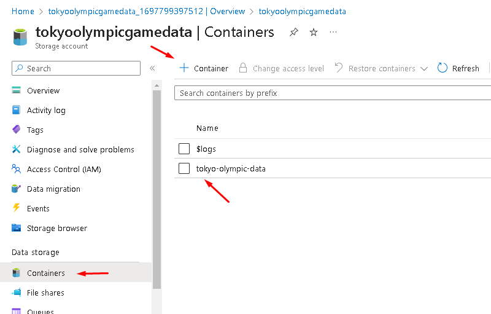
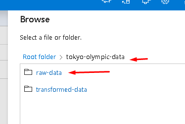
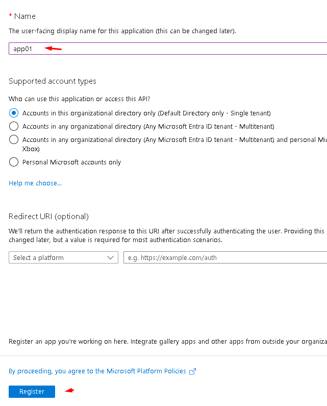
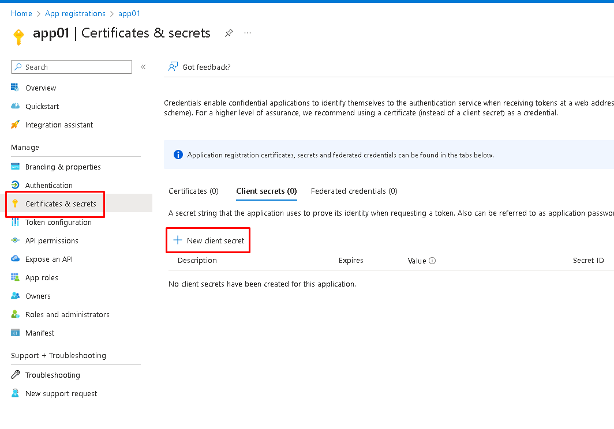

# Tokyo Olimçyc Game Project

On this project, we will try to develop an end-to-end project with some basic transformations. 
This will pass through each stage of an ingestion lifecycle.

**Brief summary:**

- Read files from a Data Source in CSV format.
- Create a Pipeline using Azure Data Factory to read the data from the source.
- Copy the data into a Storage Container (Raw Data).
- Transform the data with Azure Databricks.
- Copy the transformed data into the Storage Container (Transformed Data).
- Use Azure Synapse Analytics to create and copy the data to a database.
- Visualize and create dashboard indicators using Power BI.

To start with the project, we have to create a new Storage Account.
Choose a resource name and Storage Account Name.

After all set, create your Storage, and get into your Storage.

When it's all done, create your Container.

Create the folder that you will use in the ingestion.

Now you will have to copy the data to the container, using Azure Data Factory.
To do that, we have to create a Data Factory.
Select the resource name that you have created, and give it a name to the new Data Factory.

Once it's done, enter into your Data Factory that you have just created.

Now we start to build the Pipelines, to copy the data to the Storage Account.

Create Copy Data Activities.

In this scenario, we will copy the data from GitHub:
https://github.com/alexsrocha82/Data_Engineering/tree/main/Tokyo_Olympic_Azure_Project/Storage/raw-data

Make sure to copy the raw link.

Create the new dataset. In this case, we're going to choose HTTP because we are accessing the data from GitHub. 
And then choose the data format type.

And then choose the data format type.

Create the link service. Paste the 'raw' link into the linked service.

Create Data Lake storage where you can store your data.

Choose the data format, in our case, CSV.

Create Linked service for the Sink.

Set the path to store the data.

Once it's done, copy the data with the 'Debug' button.

When the process is done, check the container to see if the data was copied as desired.

Now we repeat the copy process for all the data files and create the 'Source' Linked service to get the data.

And adjust the 'Sink' Path.

Then copy the data. When it's all done, the ADF and the container should look like this.

The next step is to create an Azure Databricks service.

Once the Azure Databricks workspace is created, you'll have to create a Cluster. 
For this project, we can use a 'single node' because we don't need much transformation power.

The next step is to create a Notebook to start the transformations.

Select your cluster and create a security key to mount the notebook to the lake. 
To do that, go back to Azure home and search for App registrations.

Then create a new registration.

Give it any name and press 'Register.'

From there, you need to keep two codes (Application (client) ID and Directory (tenant) ID) and save them somewhere, as you'll need them later. 
Note that the keywords I'm using will not work for you; you will need to use the keywords available in your application.

Next, create the secret. Give it a name and copy the values.

Give it a name and copy the values.

Then create the basic authentication from Databricks to the data lake. 
The best practice is to create a key vault, but in this case, we'll just create a manual connection.

Now, mount the container connection. 
Go back to home -> storage account.

Copy the name of the storage to the source string connection.

And now copy the container name.

Then run.
