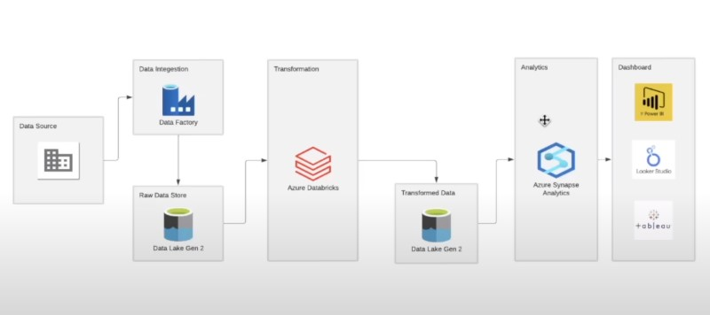

# Tokyo Olimçyc Game Project

On this project, we will try to develop an end-to-end project with some basic transformations. 
This will pass through each stage of an ingestion lifecycle.

**Brief summary:**

- Read files from a Data Source in CSV format.
- Create a Pipeline using Azure Data Factory to read the data from the source.
- Copy the data into a Storage Container (Raw Data).
- Transform the data with Azure Databricks.
- Copy the transformed data into the Storage Container (Transformed Data).
- Use Azure Synapse Analytics to create and copy the data to a database.
- Visualize and create dashboard indicators using Power BI.

